# Windows Update Deployment Script

Parallel Windows Update deployment tool for rolling out updates to remote computers across multiple sites. Starts update jobs simultaneously, monitors progress with smart completion detection, collects results with post-install verification, and generates an interactive HTML report.

## Features

- **Parallel deployment** — Updates all target machines simultaneously (PowerShell 7 `ForEach-Object -Parallel`, throttled)
- **Credential Manager** — Saves credentials to Windows Credential Manager (native P/Invoke) so you only enter them once
- **Credential pre-validation** — Tests credentials against first reachable machine before launching parallel jobs
- **Smart monitoring** — Detects completion via marker files, scheduled task state, WU job status, process detection (TrustedInstaller, msiexec, wusa), and log stability heuristics
- **Late-arrival retries** — Machines that were offline during Phase 1 are automatically picked up when they come online
- **Stuck-job detection** — Re-triggers jobs on machines stuck in "Waiting to start" after a configurable timeout
- **WUJob error surfacing** — Detects and reports silent `Invoke-WUJob` failures via marker files
- **Session-aware** — Ignores stale artifacts from previous runs using timestamp-based validation
- **Rerun-safe** — Cleans up existing PSWindowsUpdate scheduled tasks before starting new jobs; archives same-day logs for diff comparison
- **Log preservation** — When rerunning on the same day, previous run logs are archived (not deleted) and a diff is shown in the HTML report
- **Post-install verification** — Cross-references PSWindowsUpdate results against `Get-HotFix` and Windows Update API to confirm updates actually installed
- **Auto-correction** — Reclassifies false failures when verification proves an update installed successfully
- **Accurate reboot detection** — Checks actual registry reboot-pending keys instead of assuming all machines need reboot
- **Interactive HTML report** — Dashboard with sticky header (stats, alerts pinned at top), static sidebar filters, scrollable computer table with sticky column headers, expandable detail rows, search, and sort
- **Report-only mode** — Regenerate the HTML report from existing session data without re-running deployment
- **Console preservation** — Phase 2 monitoring uses cursor repositioning instead of Clear-Host, keeping Phase 1 output and errors visible
- **Re-run CSV** — Automatically generates a CSV of failed/unreachable/inconclusive machines for easy re-execution

## Prerequisites

| Requirement | Details |
|---|---|
| PowerShell | 7.0+ (required for parallel execution) |
| PSWindowsUpdate | Must be installed on **remote** machines |
| WinRM | Enabled on target computers (port 5985) |
| Credentials | Admin account with remote access to all targets |
| CSV File | Computer list with `Name` and `IP` columns |

## Usage

### 1. Prepare a CSV file

```csv
Name,IP
Site-PC-01,10.0.1.100
Site-PC-02,10.0.1.101
Site-PC-03,10.0.2.100
```

### 2. Run the script

```powershell
# Interactive (prompts for credentials and CSV file)
."Windows Update Script 12112025.ps1"

# With parameters
."Windows Update Script 12112025.ps1" -ReportPath "D:\Reports" -MaxWaitMinutes 240 -CheckIntervalSeconds 60

# Save credentials to Windows Credential Manager (first time)
."Windows Update Script 12112025.ps1" -SaveCredential

# Subsequent runs auto-load saved credentials (no prompt)
."Windows Update Script 12112025.ps1"

# Remove saved credentials
."Windows Update Script 12112025.ps1" -ClearCredential

# Regenerate report from existing session data (no deployment)
."Windows Update Script 12112025.ps1" -ReportOnly -SessionPath "C:\WindowsUpdateReports\Session_20250315_143022"
```

### Parameters

| Parameter | Default | Description |
|---|---|---|
| `-CSVPath` | Desktop (file picker) | Path to computer list CSV |
| `-ReportPath` | `C:\WindowsUpdateReports` | Where session reports are saved |
| `-MaxWaitMinutes` | `180` | Maximum monitoring duration |
| `-CheckIntervalSeconds` | `30` | How often to poll remote machines |
| `-RemoteTempPath` | `C:\temp` | Working directory on remote machines |
| `-LogStabilitySeconds` | `60` | Seconds the update log must be idle before treating as complete |
| `-MaxRetries` | `2` | Retry attempts for transient network failures |
| `-WSManTimeoutSeconds` | `10` | TCP timeout for WinRM reachability checks |
| `-ThrottleLimit` | `50` | Maximum concurrent Phase 1 job-start operations |
| `-ReportOnly` | switch | Regenerate HTML report from existing session CSVs (skips Phases 1-3) |
| `-SessionPath` | — | Path to existing session folder (required with `-ReportOnly`) |
| `-SaveCredential` | switch | Save prompted credentials to Windows Credential Manager |
| `-ClearCredential` | switch | Remove saved credentials from Credential Manager and exit |

## How It Works

```mermaid
flowchart TD
    Start([Start]) --> CredCM{Saved credentials\nin Credential Manager?}
    CredCM -->|Yes| CredLoaded[Load saved credentials]
    CredCM -->|No| Creds[Prompt for credentials]
    Creds -->|SaveCredential| CredSave[Save to Credential Manager]
    CredSave --> CredVal
    Creds --> CredVal
    CredLoaded --> CredVal{Validate credentials\nagainst first reachable machine}
    CredVal -->|Invalid| Exit([Exit])
    CredVal -->|Valid| CSV[Select CSV File]
    CSV --> Validate{Validate CSV\nName + IP columns}
    Validate -->|Invalid| Exit
    Validate -->|Valid| P1

    subgraph P1 [Phase 1: Start Update Jobs]
        direction TB
        P1a[Load computers from CSV] --> P1b[TCP pre-flight check\nport 5985]
        P1b -->|Reachable| P1c[Invoke-WUJob via\nInvoke-Command parallel]
        P1b -->|Unreachable| P1d[Mark as\nUnreachable-PreFlight]
        P1c -->|Success| P1e[Status: Started]
        P1c -->|Failure| P1f[Status: Failed]
    end

    P1 --> P2

    subgraph P2 [Phase 2: Smart Monitoring]
        direction TB
        P2a[TCP pre-check\nper machine] --> P2loop
        P2loop[Poll each computer] --> P2check{Check remote status}
        P2check -->|Marker + Log\ncurrent session| P2done[Completed]
        P2check -->|WUJob error\nmarker found| P2fail[JobStartFailed]
        P2check -->|Tasks/Jobs/Processes\nrunning| P2run[Still Running]
        P2check -->|Log writing| P2write[Writing Results]
        P2check -->|No activity| P2wait[Waiting to Start]
        P2wait -->|Stuck > threshold| P2retry[Retry job start]
        P2run --> P2sleep[Sleep interval]
        P2write --> P2sleep
        P2retry --> P2sleep
        P2sleep --> P2late{Late arrivals\nonline?}
        P2late -->|Yes| P2start[Start job on\nlate arrival]
        P2late -->|No| P2continue{All done or\ntimeout?}
        P2start --> P2continue
        P2continue -->|No| P2loop
        P2continue -->|Yes| P2exit[Exit monitoring]
    end

    P2 --> P3

    subgraph P3 [Phase 3: Collect & Verify Results]
        direction TB
        P3a[Batch create PSSessions\nto all completed machines] --> P3b[Single Invoke-Command\nacross all sessions]
        P3b --> P3b2[Read CSV + hotfixes +\npending + reboot in one call]
        P3b2 --> P3val[Validate CSV schema]
        P3val --> P3c[Parse update results\ntext + numeric codes]
        P3c --> P3v[Verify installs via\nGet-HotFix + WU API]
        P3v --> P3corr[Auto-correct false\nfailures if verified]
        P3corr --> P3r[Reboot status from\nregistry data]
        P3r --> P3d[Build per-computer\nsummary]
        P3d --> P3e[Generate rerun CSV\nfor failures]
    end

    P3 --> P4

    subgraph P4 [Phase 4: Generate Report]
        direction TB
        P4a[Calculate statistics\n+ verification counts] --> P4b[Build interactive\nHTML dashboard]
        P4b --> P4c[Save CSVs +\nHTML to session folder]
        P4c --> P4d[Open report\nin browser]
    end

    P4 --> Done([Done])

    style P1 fill:#dbeafe,stroke:#3b82f6,color:#000
    style P2 fill:#fef3c7,stroke:#f59e0b,color:#000
    style P3 fill:#d1fae5,stroke:#10b981,color:#000
    style P4 fill:#ede9fe,stroke:#8b5cf6,color:#000
```



## Output

Each run creates a timestamped session folder under `C:\WindowsUpdateReports\`:

```
Session_20250315_143022/
  job_start_status.csv        # Phase 1 results per computer
  computer_summary.csv         # Per-computer summary (includes MachineHostname, AllIPAddresses)
  all_updates.csv              # Every update across all machines (with Verified + MachineHostname)
  installed_hotfixes.csv       # Full Get-HotFix history per host (for correlation matching)
  rerun_computers.csv          # Machines that need another pass (if any)
  WindowsUpdateReport.html     # Interactive report (open in browser)
```

### HTML Report Features
- Stats dashboard with computers, installed, failed, reboot counts, and verification ratio
- Failure alert banner with clickable links to affected computers
- Verification discrepancy alert when reported status doesn't match actual install state
- Connection issue and re-run banners with download CSV button
- Sidebar with search, status filters, and action buttons
- Compact computer table with expandable detail rows
- Per-update detail showing KB, title, size, status, result, and verified indicator
- Sort computers by status (failures first)

### Post-Install Verification
The script doesn't just trust PSWindowsUpdate's output. After collecting results, it queries each machine to verify:
- **Get-HotFix** — Confirms KB articles are actually registered as installed
- **Windows Update API** — Checks if updates are still listed as "needed" (definitively not installed)
- Updates verified as installed show a green checkmark; unverified show red X
- Updates pending reboot may show as "Pending" until the machine restarts
- Driver and non-KB updates show as "N/A" (cannot be verified via hotfix lookup)

### Batched Collection (Phase 3 Performance)
Phase 3 uses batched operations for fast collection across large fleets:
1. **Batch session creation** — `New-PSSession` with all IPs at once (parallel under the hood)
2. **Single Invoke-Command** — One call fans out to all sessions simultaneously, reading CSV content, hotfixes, pending updates, and reboot status in a single round-trip
3. **No file copy** — CSV content is read directly on the remote machine and returned as string data, eliminating SMB copy overhead
4. **Local processing** — All parsing, deduplication, and verification cross-referencing happens locally (fast)

## Troubleshooting

| Issue | Solution |
|---|---|
| Script requires PS 7+ | Run from `pwsh.exe`, not `powershell.exe` |
| "Credential validation failed" | Verify username/password before running again |
| Machines show "Unreachable" | Verify WinRM is enabled: `Enable-PSRemoting -Force` on target |
| PSWindowsUpdate errors | Install on remote: `Install-Module PSWindowsUpdate -Force` |
| Defender updates show as Failed | Expected — Defender self-updates; script marks these as Skipped |
| Jobs stuck in "Waiting" | Script auto-retries after 30 min; check remote `C:\temp` for artifacts |
| Machine stuck "Running (Processes)" | Stall detection warns at 15 min, auto-releases at 30 min as "Stalled" — machine goes to rerun list. Time spent in "Running" carries over if it transitions to "Waiting" |
| Machine stuck "Unreachable" | Unreachable stall detection warns at 15 min, auto-releases at 30 min — machine goes to rerun list. Timer resets if the machine comes back online |
| Want to skip remaining machines | Press **S** during the 30-second wait between poll cycles, then confirm with **Y**. All remaining machines are marked "Skipped" and added to the rerun list. Press **L** to list remaining machines and their elapsed times |
| Double-hop auth failures | Script uses `Copy-Item -FromSession` to avoid double-hop issues |
| Status shows "Inconclusive" | Empty update log without completion marker — job may have crashed; re-run |
| Verified shows "Pending" | Update installed but not yet in hotfix list — machine needs reboot |
| Second run shows stale results | Fixed — script now removes existing PSWindowsUpdate scheduled tasks before starting new jobs |
| "Rerun" badge on computers | Previous run logs were archived; expand the detail row to see the diff |
| Old archives on remote machines | Archives from previous days are automatically cleaned up; same-day archives are preserved |

---

## Vulnerability Scan Correlation Script

`Compare-VulnScanToUpdates.ps1` correlates a Qualys vulnerability scan report (XLSX) with the `all_updates.csv` output from the deployment script to determine which vulnerabilities have been remediated.

### Usage

```powershell
# Point at a session folder (place the Qualys XLSX inside it)
.\Compare-VulnScanToUpdates.ps1 -Path "C:\temp\Session_20260313_221433"

# Include data from previous deployment runs
.\Compare-VulnScanToUpdates.ps1 -Path "C:\temp\Session_20260313_221433" -IncludePreviousLogs

# Also export a CSV alongside the XLSX report
.\Compare-VulnScanToUpdates.ps1 -Path "C:\temp\Session_20260313_221433" -ExportCsv

# Use NetBIOS instead of DNS for hostname display
.\Compare-VulnScanToUpdates.ps1 -Path "C:\temp\Session_20260313_221433" -HostnameColumn NetBIOS
```

Place the Qualys scan report (`Scan_Report_NVR__*.xlsx`) in the session folder alongside `all_updates.csv`. The script auto-discovers it.

### How It Works

1. **Reads all_updates.csv** — builds an IP+KB lookup table and tracks installed cumulative updates (parsed from the Title column, e.g., `"2026-03 Security Update (KB5079473)"`)
2. **Reads installed_hotfixes.csv** (if present) — adds full Get-HotFix history as "Installed" entries, covering KBs installed outside this deployment run. Uses `Description` ("Security Update") and `InstalledOn` date to detect cumulatives even without title info.
3. **Builds IP alias map** — reads `AllIPAddresses` from `computer_summary.csv` so machines with multiple NICs can match regardless of which IP Qualys scanned
4. **Session-verified coverage** — hosts with `NoUpdatesNeeded` or `Completed` status in `computer_summary.csv` get cumulative coverage for the session month, even if `Get-HotFix` doesn't list the latest cumulative (a known `Win32_QuickFixEngineering` limitation)
5. **Incorporates previous logs** (with `-IncludePreviousLogs`) — reads `previous_updatelog_*.csv` files from the session directory and uses `computer_summary.csv` for Name→IP mapping
6. **Reads Qualys XLSX** (via Excel COM, two-pass):
   - **Header auto-detection**: Reads row 1 to find column positions (IP, DNS, Title, Results, etc.); falls back to hardcoded positions if headers not found
   - **Pass 1**: Reads all rows and builds a global KB→date map — if KB5077212 has "February 2026" context in any row, that date applies to all rows referencing KB5077212. Date extraction prioritizes Title ("Month YYYY") over Results/Solution (YYYY-MM) for reliability, and validates months 1-12 to prevent CVE number contamination.
   - **Pass 2**: Correlates each vulnerability against installed updates
7. **Matches per host** — for each vulnerability, checks if required KBs were installed:
   - **Exact match**: KB found in lookup with Status = "Installed" or "Pending" → `Remediated`
   - **Cumulative supersession**: KB not found, but host has a newer cumulative update from the **same product family** (Windows, .NET) with a month >= the missing KB's month → `Remediated (Cumulative)`
   - **Not found**: KB missing and no covering cumulative → `Not Remediated`
   - **No KB info**: Vulnerability has no KB reference (EOL OS, app-level) → `Manual Review`

### Cumulative Update Logic

Windows cumulative updates supersede all prior monthly patches. The script uses multiple detection strategies:

1. **Global KB date map**: All Qualys entries are scanned first to build a KB→date mapping. Date context is extracted from vulnerability titles (e.g., "Security Update for January 2026"), Results column (YYYY-MM patterns), and Solution column. Title is checked first (most reliable — never contains CVE numbers). All YYYY-MM regex matches validate month 1-12 to prevent CVE identifiers (e.g., `CVE-2026-20805`) from being parsed as invalid dates.

2. **Hotfix metadata detection**: When `installed_hotfixes.csv` includes `Description` and `InstalledOn` columns, KBs with `Description = "Security Update"` are treated as cumulatives. The `InstalledOn` date provides the supersession month, and the product family defaults to "Windows" when no title is available (monthly OS cumulatives are the vast majority of "Security Update" entries from Get-HotFix).

3. **Session-verified coverage**: `Get-HotFix` (`Win32_QuickFixEngineering`) doesn't always list the newest cumulative update. When a host has `NoUpdatesNeeded` or `Completed` status in `computer_summary.csv`, the session date (from the folder name) is used as proof of cumulative coverage — PSWindowsUpdate confirmed the machine was current.

4. **Supersession check**: For each missing KB, if the host has an installed cumulative update from the same product family (Windows, .NET, Other) with a month >= the missing KB's month, the vulnerability is marked `Remediated (Cumulative)`.

### Output

2-sheet XLSX report:
| Sheet | Contents |
|---|---|
| **Host Summary** | Per-host totals, % remediated (color-coded), site name, latest cumulative, outstanding items (missing KBs + manual review vulns), and resolution details from Qualys for unresolved vulnerabilities |
| **Unmatched Hosts** | Hosts in one dataset but not the other (data quality check) |

### Expected Qualys XLSX Columns

Column positions are **auto-detected from the header row**. If headers aren't found, the script falls back to these default positions:

| Default Index | Field | Usage |
|---|---|---|
| 1 | IP | Primary match key |
| 3 | DNS | Hostname display (default) |
| 4 | NetBIOS | Fallback hostname (or primary with `-HostnameColumn NetBIOS`) |
| 9 | Title | Vulnerability name, month name date extraction |
| 12 | Severity | Severity rating |
| 21 | CVE | CVE identifier(s) |
| 26 | Solution | Secondary KB source, YYYY-MM date extraction |
| 29 | Results | Primary KB source — `Missing Patch/KB: KBxxxxxxx` pattern, YYYY-MM date extraction |

### "No Scan Results" Host Detection

The Qualys XLSX often includes summary rows at the bottom listing hosts that returned no vulnerability data. These rows have comma-separated IPs in column A and text like "No results available for these hosts" or "No vulnerabilities match the search criteria" in column F. The script detects these rows during Pass 1 and includes them in the Unmatched Hosts sheet with the reason text, so you can see which hosts Qualys couldn't scan and follow up accordingly.

### Known Limitations

- **IP address space mismatch**: If `AllIPAddresses` data is available in `computer_summary.csv` (requires latest update script), the correlation script maps all IPs on each machine back to the deployment IP. Without this data, hosts scanned on a different interface won't match. The Unmatched Hosts sheet reports these.
- **Cumulative supersession from hotfix history**: KBs known only from `installed_hotfixes.csv` (pre-installed, not deployed this run) inherit cumulative metadata from `all_updates.csv` if the same KB appears there on any machine. KBs with `Description = "Security Update"` and `InstalledOn` date default to "Windows" product family when no title is available.
- Cumulative supersession checks **product family** (Windows vs .NET vs Other) — a Windows cumulative won't cover a .NET KB. If no date context is available for a missing KB (even across all Qualys entries), exact matching is used.
- **Session-verified coverage** depends on the session folder timestamp and `computer_summary.csv` being present. It only applies to hosts with `NoUpdatesNeeded` or `Completed` status — failed, stalled, or skipped hosts are excluded.
- Requires Excel COM (Excel must be installed on the machine running the script)
- Requires PowerShell 7+ (uses `if` as expression syntax)
